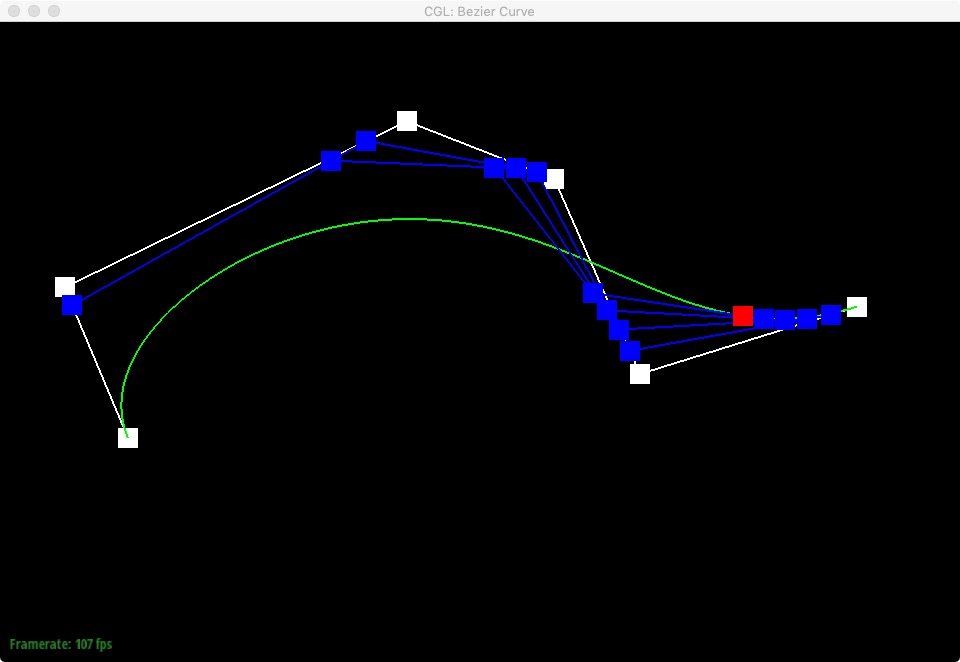

# Mesh-Editor
Implemented mesh subdivision using half-edge data structure. 

 

## Section I: Bezier Curves and Surfaces
### Bezier curves with 1D de Casteljau subdivision
  
### Bezier surfaces with separable 1D de Casteljau subdivision

 

## Section II: Sampling

Average normals for half-edge meshes

  

 

## Half-edge flip
  
  

 

### Half-edge split and flip
  

 

## Section III: Loop subdivision for mesh upsampling

Torus

    

 

Asymmetric cube

  
  

 

Symmetric cube (pre-split)

    
 
